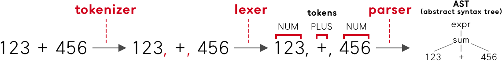
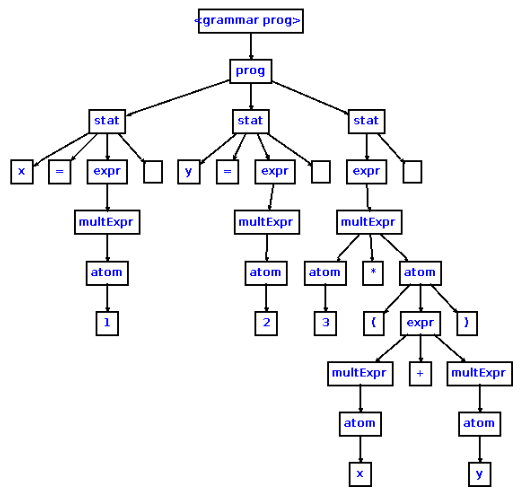
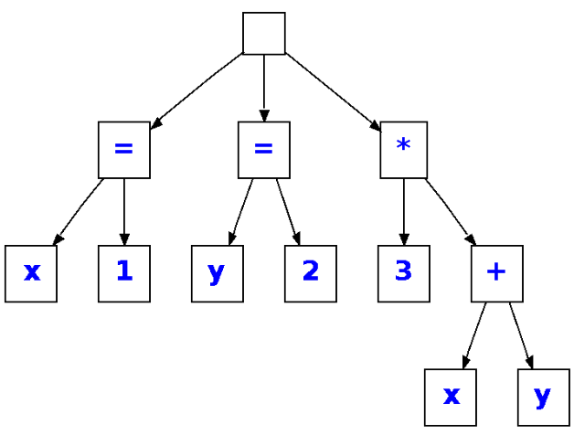

# Array파서 - 무한중첩

## 1. 사전 지식

### tokenizer, lexer, parser

세 개념에 대해 알아보기 전 먼저 **파싱(Parsing)**에 알아야 합니다. 언어학에서 파싱은 '구문 분석'이라고 부릅니다. 문장을 구성 성분으로 분해하고 그들 사이의 위계 관계를 분석해 문장 구조를 결정하는 것 입니다. 이와 비슷하게 CS에서는 일련의 문자열을 의미 있는 토큰 단위로 분해하고 이를 parse tree로 변환하는 과정을 뜻합니다.

**파서(Parser)**는 이러한 파싱을 수행하는 프로그램입니다. 파서를 세부적으로 나눈다면 세 가지 구성 요소로 나뉩니다.

1. **tokenizer**
2. **lexer**
3. **parser**

tokenizer, lexer 그리고 parser에 대해 좀 더 자세히 살펴 보겠습니다. tokenizer와 lexer를 합하여 lexer라고 하기도 합니다. lexer와 parser는 연속적으로 작동합니다. **tokenizer**는 input을 알맞은 토큰 단위로 나눠주고, **lexer**는 나눠진 토큰 들을 분석해 문맥적 의미를 부여합니다. 마지막으로 **parser**는 분석된 token들을 문법적으로 검사하고, **parse tree**(**Abstract Syntax Tree**로 나타내기도 함)로 만들어 줍니다.



이 그림에서 tokenizer는 ' '을 기준으로 1,2,3이 하나의 문자열임을 파악하고 묶어 줍니다. 차례로 +와 456을 나누어 반환합니다. 그렇게 구분된 토큰 들을 lexer는 차례로 분석합니다. 123과 456은 NUM에 해당하는 타입이고 +는 Plus 연산자 타입 임을 구분하고 분류합니다.

마지막으로 parser는 lexer가 구분하고 부여한 문맥적 의미를 parse tree(혹은 AST)의 형태로 바꾸어 줍니다. 여기서 Parse tree와 AST는 다릅니다. Parse Tree는 input 전체를 구체적으로 표현하였기 때문에 공백이나 괄호가 모두 들어갑니다.



AST는 input을 축약하여 표현했기 때문에 부모가 없고 괄호가 들어가지 않습니다.



> **참고 :**
> 1. [https://tomassetti.me/parsing-in-javascript/](https://tomassetti.me/parsing-in-javascript/)
> 2. [https://gyujincho.github.io/2018-06-19/AST-for-JS-devlopers](https://gyujincho.github.io/2018-06-19/AST-for-JS-devlopers)


## 2. 구현 목표


- 무한 중첩 구조도 동작하게 한다. [[[[[]]]]]
  
    - hint : 중첩 문제를 풀기 위해 stack구조를 활용해서 구현할 수도 있다.
- 숫자 타입 이외에 string, boolean, null 타입도 지원하도록 구현한다.

    `"['1a3',[null,false,['11',[112233],112],55, '99'],33, true]"`

- 올바른 문자열이 아닌 경우 오류를 발생한다. (아래 실행 결과 참고)

```javascript
var s = "['1a3',[null,false,['11',[112233],112],55, '99'],33, true]";
var result = ArrayParser(str);
console.log(JSON.stringify(result, null, 2));
```


## 3. 프로그램 설계 및 구현


### 1단계 : tokenizer, lexer, parser 설계

tokenizer과 lexer 그리고 parser의 정의에 충실하게 기능들을 차례로 구현하고자 합니다.

`"[123, 'a123', [1,2,3], null]"`를 예시로 하면 다음과 같습니다.

* **tokenizer** : `123`, `'a123'`, `[1,2,3]`, `null`로 분해합니다.

* **lexer** : `123`의 경우 `{type: 'number', value: '123'}`로 각각 문맥적 의미를 부여하여 분석한 객체를 반환합니다. 차례로 남은 세 토큰도 동일하게 분석한 객체를 각각 생성합니다. 그리고 모든 객체를 배열로 담아 반환합니다.

* **parser** : 각 토큰 들의 관계에 관한 규칙을 정의하고 그 규칙에 따라 parse tree를 만들어 반환합니다. 여기서 배열 내의 배열의 경우 `child`로 분류하고 이를 객체의 키로 만들어 해당하는 값을 넣어 줍니다. 그리고 완성된 parse tree를 `retrun`으로 반환합니다.

```javascript
{ type: 'array',
	child: 
		[ { type: 'number', value: '123', child: [] },
			{ type: 'string', value: 'a123', child: [] },
			{ type: 'array', child: [{type: 'number' ...}] },
			{ type: 'null', value: 'null', ...}
		] 
}
```


### 2단계 : 기본적인 메서드 input, output 설정

 ArrayParaser를 객체로 바꿔 보았습니다. `ArrayParser.js`와 `app.js`를 서로 나누어 파서와 관련된 기능들은 모두 `ArrayParser.js`에 넣고 실제 작동은 `app.js`에서 불러와 작동하고자 합니다.

```javascript
//app.js
const ArrayParser = require('./ArrayParser');

arrayParser = new ArrayParser();

var str = "['1a3',[null,false,['11',[112233],112],55, '99'],33, true]";

console.log(arrayParser.tokenizer(str));

result = {};
console.log(JSON.stringify(result, null, 2));
```

```javascript
//ArrayParser.js
module.exports = class ArrayParser {
    constructor() {
    }
};
```

주요 기능 메서드로 `tokenizer`, `lexer`, `parser`를 작성했습니다. `constructor()`에 관한 것은 차차 생각해보고 우선 주요 기능에 대해 빠르게 만들어 봅니다.

```javascript
//ArrayParser.js
module.exports = class ArrayParser {
    constructor(){}
    tokenizer(){}
    lexer(){}
    parser(){}
};
```

각 주요 메서드의 `input`과 `output`을 설정해 줍니다.
- 먼저 **tokenizer**는 `input`으로 들어온 문자열을 token단위로 나눠주는 역할을 함. 나눠진 토큰 배열을 리턴합니다.
- **lexer**는 `tokenizer()`에서 나눠진 token들을 분석해 의미를 부여하는 역할을 합니다. `tokenArr`를 `input`으로 받고 `return`으로 의미를 담은 토큰 객체들을 배열에 담아 반환합니다.
- **parser**는 의미를 가지게 된 토큰에 대한 규칙을 정의하고 이 규칙이 문법적으로 올바른지 검사합니다. 토큰 객체 들을 `input`으로 받고 이를 parse tree로 변환하여 반환합니다.

```javascript
//ArrayParser.js
module.exports = class ArrayParser {
    constructor(){}
    tokenizer(str){
        const tokenArr = [];
        return tokenArr;
    }
    lexer(tokenArr){
        const contextTokenArr = [];
        return contextTokenArr;
    }
    parser(tokenObj){
        const parseTree = {};
        return parseTree;
    }
};
```


### 3단계 : tokenizer구현

`tokenizer()`는 우선 받아온 문자열을 `letter`단위로 쪼개 이를 차례대로 순회하며 정해진 구분자(seperator)를 만나게 되면 token을 `tokenArrr`로 push 합니다. 여기서 기준이 되는 구분자는 `[`와 `]` 그리고 `,`입니다. 또한, 이 구분자를 만날 때 까지 `letter`를 `stack`에 담아둡니다. tokenizer의 경우 `[`, `]`, `,` 또한 token으로 분리해서 tokenArr에 담는 것이 tokenizer의 원래 목적에 부합한다고 생각하여 넣어 줍니다.

```javascript
isSeperator(char){
    return char === '[' || char === ']' || char === ',')
}

tokenizer(str){
    const tokenArr = [];
    let tokenStack = [];

    for (let char of str){
        if (this.isSeperator(char)) {
            let token = tokenStack.join('').trim();
            tokenStack = [];
            if (token !== '') tokenArr.push(token);
            tokenArr.push(char);
            continue
        }
        tokenStack.push(char);
    }
    return tokenArr
}
```

근데 여기서 한가지 문제가 예상됩니다. 만약 문자열 내부에 있는 `[`, `]`, `,`인 경우에도 token으로 만들어 버리기 때문에, 이를 해결하기 위해서 String의 Quote(따옴표)사이에 위치한지, 검사합니다. 이를 위해서는 Quote를 만날 때 마다 Stack에 넣습니다. 만약 Stack 안에 Quote가 이미 있다면 동일한 Quote 인지 체크 한 다음 동일할 경우 pop을 하여 Stack을 비워주고 다를 경우 그냥 지나치게 됩니다. Stack길이가 0이 인지 아닌지를 통해 현재 String의 Quote사이에 있는 상태 인지를 판별합니다.

```javascript
module.exports = class ArrayParser {
constructor() {
  this.quoteStack = [];
}

isQuote(char) {
  return char === '"' || char === "'";
}

isSeperator(char) {
  return char === "[" || char === "]" || char === ",";
}

pushToQuoteStack(char) {
  if (this.quoteStack.length === 0) {
    this.quoteStack.push(char);
  } else {
    if (this.quoteStack[0] === char) {
      this.quoteStack.pop();
    }
  }
}

isInString() {
  return this.quoteStack.length !== 0;
}

tokenizer(str) {
  const tokenArr = [];
  let tokenStack = [];

  for (let char of str) {
    if (this.isQuote(char)) {
      this.pushToQuoteStack(char);
    }
    if (this.isSeperator(char) && !this.isInString()) {
      let token = tokenStack.join("").trim();
      tokenStack = [];
      if (token !== "") tokenArr.push(token);
      tokenArr.push(char);
      continue;
    }
    tokenStack.push(char);
  }
  return tokenArr;
}
```


### 4단계 : lexer구현

`lexer()`는 tokenizer에서 나눈 토큰 배열을 받아와 분석하여 문맥적 의미를 부여합니다. 분석 결과는 다음과 같습니다. 이러한 객체를 생성하고 그 객체들을 모두 배열로 담고, 그 배열을 `return` 합니다.

```javascript
lexer(tokenArr) {
  const contextTokenArr = [];
  return contextTokenArr;
}
```

세밀한 타입 체크에 앞서 우리가 분석한 객체에 담을 데이터를 다음과 같이 정의합니다.

```javascript
{ type: 'number', value: '123' }
{ type: 'bracket', value: '[' }
{ type: 'comma', value: ','}
```

각 토큰을 순회하면서 타입을 체크하여 context token을 반환하는 함수를 만들어 줍니다.

```javascript
makeContextToken(token) {
  let tokenType = "";
  if (token === "[" || token === "]") tokenType = "bracket";
  if (token === ",") tokenType = "comma";

  const contextToken = {
    type: tokenType,
    value: token
  };

  return contextToken;
}

lexer(tokenArr) {
  const contextTokenArr = [];
  for (let token of tokenArr) {
    let contextToken = this.makeContextToken(token);
    contextTokenArr.push(contextToken);
  }
  return contextTokenArr;
}
```

`makeContextToken()`이 너무 복잡해질 것 같아 `checkTokenType()`이라는 함수를 만들어 주고 TokenType을 체크합니다.

```javascript
makeContextToken(token) {
  const contextToken = {
    type: this.checkTokenType(token),
    value: token
  };
  return contextToken;
}
```

```javascript
checkTokenType(token) {
  let tokenType = "";
  switch (token) {
    case ("[", "]"):
      tokenType = "bracket";
      break;
    case ",":
      tokenType = "comma";
      break;
    case ("true", "false"):
      tokenType = "boolean";
      break;
    case "null":
      tokenType = "null";
      break;
    default:
      tokenType = "string";
  }
  return tokenType;
}
```

여기서 `default`부분에서 남은 string과 숫자를 처리합니다. 직관적으로 잘 보이기는 하나 `checkTokenType`을 전체적으로 봤을 때 너무 길어지는 것 같아 `constructor()`에 `staticTokenType`을 만들어 `[`, `null`, `true`와 같이 값이 딱 정해진 Token Type을 담아줍니다.

```javascript
constructor() {
  this.quoteStack = [];
  this.staticTokenType = {
    "[": "bracket",
    "]": "bracket",
    ",": "comma",
    true: "boolean",
    false: "boolean",
    null: "null"
  };
```

```javascript
checkTokenType(token) {
  let tokenType = "";
  if (token in this.staticTokenType) {
    tokenType = this.staticTokenType[token];
  }
  return tokenType;
}
```

결과를 한 번 콘솔에 출력하면 다음과 같이 원하는 대로 출력이 되는데, 문자열의 경우 Quote가 들어있습니다. 처음에는 이를 기준으로 문자열 인지 아닌지를 판단하고자 하였지만 그것보다 우선은 숫자를 체크한 이후에 남은 것은 string으로 판단하고 후에 parser에서 에러 처리를 한 번에 해주는 게 나을 것 같다는 생각이 들었습니다.

```javascript
[ { type: 'bracket', value: '[' },
  { type: '', value: '\'1a3\'' },
  { type: 'comma', value: ',' },
  { type: 'bracket', value: '[' },
  { type: 'null', value: 'null' },
  { type: 'comma', value: ',' },
  { type: 'boolean', value: 'false' },
...
```

이에 따라 숫자를 먼저 판단하고 남은 것은 우선 string으로 분류합니다.

```javascript
checkTokenType(token) {
  if (token in this.staticTokenType) {
    return this.staticTokenType[token];
  }
  if (isFinite(Number(token))) {
    return "number";
  }
  return "string";
}
```

이제 원하는 대로 lexer를 구현하는 것이 완료되었습니다.

### 5단계 : parser구현

이제 마지막으로 `parer()`를 구현합니다. parser에서는 해당 token이 문법적으로 옳은 지를 판단하는 함수를 만들고, 정해진 기    준에 따라 parse트리를 생성해 줍니다.

조건에서 주어진 두 에러에 대해 먼저 다뤄 봅니다.

```javascript
var s = "['1a'3',[22,23,[11,[112233],112],55],33]";  //'1a'3'은 올바른 문자열이 아닙니다.
 var result = ArrayParser(str);
 ==>  //'1a'3'은 올바른 문자열이 아닙니다.

 var s = "['1a3',[22,23,[11,[112233],112],55],3d3]";  // 3d3은 알수 없는 타입입니다
var result = ArrayParser(str);
 ==> // 3d3은 알수 없는 타입입니다
```

먼저 올바른 문자열이 아닌 경우에 현재의 코드로 작동할 경우 1a이후에 string Quote안에 있다고 판단하기 때문에 해당 token부터 이후 토큰까지 tokenArr에 담기지 않게 됩니다.

```javascript
[ { type: 'bracket', value: '[' } ]
```

여기서 문제가 발생합니다.  첫 예제를 보면 1a 다음에 다시 quote를 만나고

```javascript
makeToken(char) {
    if (this.isQuote(char)) {
      this.pushToQuoteStack(char);
    }
    if (this.isSeperator(char) && !this.isInString()) {
      let token = this.tokenStack.join("").trim();
      this.tokenStack = [];
      if (token !== "") return [token, char];
      return char;
    }
    this.tokenStack.push(char);
  }

  tokenizer(str) {
    return str
      .split("")
      .reduce((tokenArr, char) => {
        return [...tokenArr].concat(this.makeToken(char));
      }, [])
      .filter(Boolean);
  }
```