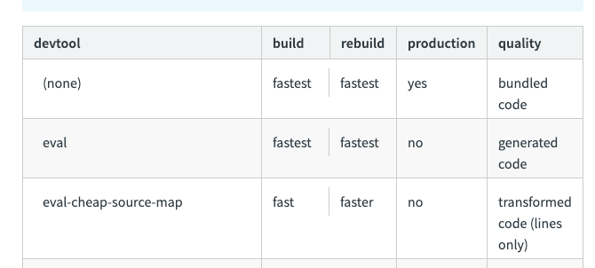

# React를 위한 Webpack 배우기 - 01

해당 포스팅은 아래의 포스트를 번역 및 일부 설명을 추가하여 작성한 글입니다.

[Learn Webpack for React - Esau Silva](https://esausilva.com/2018/01/13/learn-webpack-for-react/#comment-52112)

시작하기에 앞서 이번 튜토리얼에서는 아래의 라이브러리를 다룰 예정입니다.

- React 16
- React Router 5
- Semantic UI as the CSS Framework
- Hot Module Replacement (HMR)
- CSS Autoprefixer
- CSS Modules
- @babel/plugin-proposal-class-properties
- @babel/plugin-syntax-dynamic-import
- Webpack 4
- Code Splitting by Route and Vendor
- Webpack Bundle Analyzer

## 전제 조건

해당 튜토리얼을 위해서는 Yarn과 Node가 기본적으로 설치되어 있어야 합니다. 또한, React와 React Router에 대한 기본적인 지식이 있어야 합니다.

## 초기 의존성

우선 튜토리얼을 위한 프로젝트 폴더 생성 후 `yarn`을 이용하여 `package.json`을 생성합니다. 

```bash
mkdir webpack-for-react && cd $_
yarn init -y
```

위의 명령어를 통해 별도의 설정 없이 기본 값으로 `package.json`을 생성합니다. 

```json
{
  "name": "webpack-for-react",
  "version": "1.0.0",
  "main": "index.js",
  "license": "MIT"
}
```

이제 필요한 초기 의존성과 개발 의존성을 설치합니다. 아래의 개발 의존성은 끝에 `-D` 옵션이 붙습니다.

```bash
# Initial Dependencies
yarn add react react-dom prop-types react-router-dom semantic-ui-react

# Development Dependencies
yarn add @babel/core babel-loader @babel/preset-env @babel/preset-react @babel/plugin-proposal-class-properties @babel/plugin-syntax-dynamic-import css-loader style-loader html-webpack-plugin webpack webpack-dev-server webpack-cli -D
```

설치 이후에 `package.json`은 아래와 같이 `dependencies`와 `devDependencies`로 나뉘어 있습니다. (production)`dependencies`는 실제 배포되는 애플리케이션에서,  `devDependencies`는 개발 단계에서만 사용됩니다.

```json
{
  "name": "webpack-for-react",
  "version": "1.0.0",
  "main": "index.js",
  "license": "MIT",
  "dependencies": {
    "prop-types": "^15.7.2",
    "react": "^16.13.1",
    "react-dom": "^16.13.1",
    "react-router-dom": "^5.2.0",
    "semantic-ui-react": "^0.88.2"
  },
  "devDependencies": {
    "@babel/core": "^7.9.6",
    "@babel/plugin-proposal-class-properties": "^7.8.3",
    "@babel/plugin-syntax-dynamic-import": "^7.8.3",
    "@babel/preset-env": "^7.9.6",
    "@babel/preset-react": "^7.9.4",
    "babel-loader": "^8.1.0",
    "css-loader": "^3.5.3",
    "html-webpack-plugin": "^4.3.0",
    "style-loader": "^1.2.1",
    "webpack": "^4.43.0",
    "webpack-cli": "^3.3.11",
    "webpack-dev-server": "^3.11.0"
  }
}
```

각 패키지에 대한 설명은 아래와 같습니다.

| Package | 내용 |
| ------- | ---- |
| react |	리액트 |
| react-dom |	브라우저를 위한 DOM 메서드를 제공 |
| prop-types |	Runtime type checking for React props |
| react-router-dom	| Provides routing capabilities to React for the browser |
| semantic-ui-react |	CSS Framework |
| babel	| Babel is a transpiler that compiles JavaScript ES6 to JavaScript ES5 allowing you to write JavaScript “from the future” so that current browsers will understand it. Detailed description in Quora. |
| @babel/core	| Core dependencies for Babel |
| babel-loader|	This package allows transpiling JavaScript files using Babel and webpack |
| @babel/preset-env |	With this you don’t have to specify if you will be writing ES2015, ES2016 or ES2017. Babel will automatically detect and transpile accordingly. |
| @babel/preset-react	| Tells Babel we will be using React |
| @babel/plugin-proposal-class-properties |	Use class properties. We don’t use Class Properties in this project, but you will more than likely use them in your project |
| @babel/plugin-syntax-dynamic-import	| Be able to use dynamic imports |
| css-loader	| Interprets @import and url() like import/require() and will resolve them |
| html-webpack-plugin |	Can generate an HTML file for your application, or you can provide a template |
| style-loader|	CSS를 `<style>`태그로 DOM에 추가함 |
| webpack	| 모듈 번들러(Module Bundler) |
| webpack-cli	| Webpack 4.0.1 혹은 그 이상에서 필요한 커맨드라인 인터페이스 |
| webpack-dev-server | 애플리케이션을 위한 개발 서버를 제공함 |

## Babel 설정

`webpack-for-react` 루트 디렉토리에 configuration 파일을 생성합니다.

```bash
touch .babelrc
```

그리고 에디터로 해당 파일을 열어 아래와 같이 babel 설정을 합니다. 해당 설정은 나중에 Webpack의 `babel-loader`를 통해서 호출되어 사용됩니다.

```json
{
    "presets": ["@babel/preset-env", "@babel/preset-react"],
    "plugins": [
      "@babel/plugin-syntax-dynamic-import",
      "@babel/plugin-proposal-class-properties"
    ]
}
```

## Webpack 설정

이제 아래의 명령어로 Webpack configuration파일을 생성합니다.

```bash
touch webpack.config.js
```

`webpack.config.js` 파일을 열어 아래와 같이 코드를 추가합니다. 아래의 코드는 webpack의 기본입니다. 

```javascript
const webpack = require("webpack");
const HtmlWebpackPlugin = require("html-webpack-plugin");
```

`webpack`과 `html-webpack-plugin`을 불러옵니다. 여기서 `html-webpack-plugin`은 번들화한 css, js파일들을 html파일에 직접 추가하지 않아도 자동으로 넣을 수 있도록 도와줍니다. 

그리고 그 아래에 이용할 포트를 설정합니다. 환경 변수의 `PORT`가 있으면 해당 포트를 이용하고 아니라면, 기본으로 사용할 포트를 지정할 수 있습니다.

```javascript
const webpack = require("webpack");
const HtmlWebpackPlugin = require("html-webpack-plugin");
const port = process.env.PORT || 3000;
module.exports = {
  // Webpack configuration goes here
};
```

그러고나서 `mode`를 설정합니다. 여기서 `mode`는 webpack에게 해당 설정이 `development`를 위한 것인지 `production`위한 것인지를 알려주는 역할을 합니다.

```javascript
...
module.exports = {
  mode: 'development',
};
```

실행중인 webpack 인스턴스를 얻기 위해서는 `entry`와 `output`에 대한 설정이 필요합니다.

```javascript
...
module.exports = {
...
  entry: "./src/index.js",
  output: {
    filename: "bundle.[hash].js"
  }
};
```

- `entry` : 애플리케이션의 진입점을 설정합니다. React app이 실행되는 곳이며, 번들 프로세스가 시작되는 곳입니다.
    - 해당 `entry`설정은 webpack 4에 들어와 몇 가지 기본값이 생겼는데, 그 중 `entry`역시 기본으로 `./src` 를 경로로 잡습니다.
- `output` : 컴파일된 파일을 디스크에서 어디에 저장할지 설정합니다.
    - `filename` : 번들링 된 애플리케이션의 이름을 지정합니다. 여기서 `[hash]` 부분은 응용 프로그램이 변경되고 다시 컴파일 될 때마다(웹 캐싱에 도움이 됨) Webpack에 의해 생성된 해시로 대체됩니다.

`devtool`은 애플리케이션 디버깅에 도움이 되는 source map을 만듭니다. 여기서 Source map은 배포를 위해 빌드한 파일과 원본 파일을 서로 연결시켜 주는 기능입니다. source map은 다양한 종류가 있으며, 지금 사용하는 `inline-source-map`은 개발시에만 써야 합니다. 다양한 소스맵은 [여기서](https://webpack.js.org/configuration/devtool/) 확인할 수 있습니다. 

```javascript
...
module.exports = {
	...
	devtool: 'inline-source-map',
};
```



그 다음으로 `module`과 `rules`입니다. 아래와 같이 코드를 작성합니다.

```javascript
...
module.exports = {
  ...
  module: {
    rules: [
      // Rule 1:
      {
        test: /\.(js)$/,
        exclude: /node_modules/,
        use: ['babel-loader']
      },
      // Rule 2:
      {
        test: /\.css$/,
        use: [{
            loader: 'style-loader'
          },
          {
            loader: 'css-loader',
            options: {
              modules: true,
              localsConvention: 'camelCase',
              sourceMap: true
            }
          }
        ]
      }
    ]
  },
};
```

- `module` : 애플리케이션이 포함할 모듈의 종류를 지정합니다. 이번 튜토리얼에서는 ESNext(Babel)과 CSS Module을 지원합니다.
- `rules` : 다른 종류의 모듈을 처리하는 방법을 지정합니다.
    - **Rule 1:**
        - `node_modules`폴더를 제외한 `.js` 확장자를 가진 파일을 테스트합니다.
        - Babel(`babel-loader`)을 사용하여 Vanilla Javascript로 변환합니다.
    - **Rule 2:**
        - `.css` 확장자를 가진 CSS파일을 테스트합니다.
        - 여기서는 `style-loader`와 `css-loader` 두 종류의 로더를 사용합니다.
        - CSS Modules, camel case 그리고 source map을 만들도록 `css-loader`에 지시합니다.
    - **CSS Modules and Camel Case:**
        - 해당 규칙이 있어야 `import Styles from './styles.css'`와 같은 문법을 쓸 수 있습니다.
        - 또한, `import { style1, style2 } from './styles.css'`와 같은 destructuring을 쓸 수 있습니다.
        - Camel case는 아래와 같이 쓸 수 있습니다.

            ```css
            .home-button { ... }
            ```

            ```javascript
            import { homeButton } from './style.css'
            ```

이제 `html-webpack-plugin` 플러그인에 대해 상세 설정을 추가해 봅시다. `html-webpack-plugin`은 다른 옵션을 가진 객체를 허용합니다. 여기서는 사용할 HTML 템플릿에 favicon을 지정합니다. 뒤에서 추가로 Bundle Analyzer과 HMR에 대한 플러그인 설정을 추가할 겁니다.

```javascript
...
module.exports = {
  ...
  plugins: [
    new HtmlWebpackPlugin({
      template: 'public/index.html',
      favicon: 'public/favicon.ico'
    })
  ],
};
```

마지막으로 개발 서버에 대한 설정을 해보겠습니다. `localhost`를 호스트로 지정하고 변수 `port`를 포트로 지정합니다. 또한, `historyApiFallback`와 `open`을 `true`로 설정합니다. 해당 설정이 있어야 브라우저를 자동으로 열고 애플리케이션을 실행합니다.

```javascript
...
module.exports = {
  ...
  devServer: {
    host: 'localhost',
    port: port,
    historyApiFallback: true,
    open: true
  }
};
```

전체적인 코드는 아래와 같습니다.

```javascript
const webpack = require("webpack");
const HtmlWebpackPlugin = require("html-webpack-plugin");
const port = process.env.PORT || 3000;

module.exports = {
  mode: "development",
  entry: "./src/index.js",
  output: {
    filename: "bundle.[hash].js",
  },
  devtool: "inline-source-map",
  module: {
    rules: [
      // First Rule
      {
        test: /\.(js)$/,
        exclude: /node_modules/,
        use: ["babel-loader"],
      },
      // Second Rule
      {
        test: /\.css$/,
        use: [
          {
            loader: "style-loader",
          },
          {
            loader: "css-loader",
            options: {
              modules: true,
              localsConvention: "camelCase",
              sourceMap: true,
            },
          },
        ],
      },
    ],
  },
  plugins: [
    new HtmlWebpackPlugin({
      template: "public/index.html",
      favicon: "public/favicon.ico",
    }),
  ],
  devServer: {
    host: "localhost",
    port: port,
    historyApiFallback: true,
    open: true,
  },
};
```