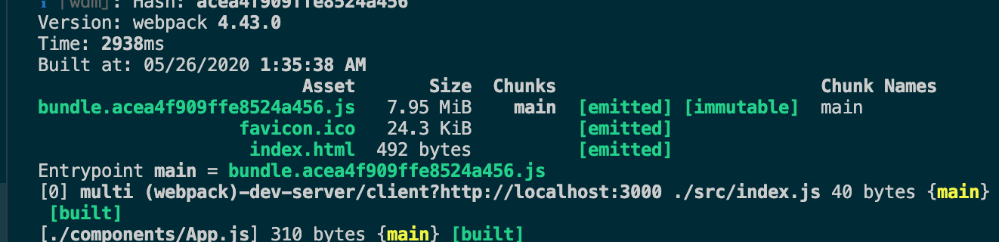

# React를 위한 Webpack - 02

> 해당 포스팅은 아래의 포스트를 번역 및 일부 설명을 추가하여 작성한 글입니다.
> [Learn Webpack for React - Esau Silva](https://esausilva.com/2018/01/13/learn-webpack-for-react/#comment-52112)


## React 애플리케이션 만들기

### index 생성

이번 시간에는 간단한 세 라우터로 이루어진 Hello World 앱을 만들어 보려 합니다.

1. Home page
2. Not Found page
3. Dynamic page 
    - 코드 분할을 구현할 때 비동기적으로 로드 할 동적 페이지

앞에서 잘 따라 했다면, 아래와 같은 프로젝트 구조가 됩니다.

```bash
|-- node_modules
|-- .babelrc
|-- package.json
|-- webpack.config.js
|-- yarn.lock
```

우선 아래와 같은 명령어로 `public` 폴더 내부에 `index.html`을 생성합니다. 

```bash
mkdir public && cd $_
touch index.html
```

`index.html`에는 [semantic-ui](https://semantic-ui.com/)를 쓰기 위한 `link`태그를 추가합니다. 그리고 `body`태그 내부에는 `root`를 `id`로 가지는 `div`태그를 생성합니다. `#root`에 리액트 앱을 render할 예정입니다.

```html
<!DOCTYPE html>
<html lang="en">
	<head>
	  <meta charset="UTF-8">
	  <meta name="viewport" content="width=device-width, initial-scale=1.0">
	  <meta http-equiv="X-UA-Compatible" content="ie=edge">
	  <link rel="stylesheet" href="//cdnjs.cloudflare.com/ajax/libs/semantic-ui/2.2.13/semantic.min.css"></link>
	  <title>webpack-for-react</title>
	</head>
	<body>
	  <div id="root"></div>
	</body>
</html>
```

그리고 favicon을 [여기서](https://github.com/esausilva/react-starter-boilerplate-hmr/blob/master/public/favicon.ico) 다운 받아 `public`에 설치합니다.

`index.js`를 생성하고 아래와 같이 코드를 작성합니다.

```bash
cd ..
mkdir src && cd $_
touch index.js
```

```javascript
import React from "react";
import ReactDOM from "react-dom";
import App from "./components/App";

ReactDOM.render(<App />, document.getElementById("root"));
```

그리고 `components` 폴더를 만들어 주어 필요한 컴포넌트를 생성합니다.

```bash
mkdir components && cd $_
touch App.js Layout.js layout.css Home.js DynamicPage.js NoMatch.js
```

컴포넌트를 모두 생성하면 아래와 같은 구조가 됩니다. 차례차례 각 컴포넌트에 코드를 작성 해봅시다.

```bash
|-- node_modules
|-- public
    |-- index.html
    |-- favicon.ico
|-- src
    |-- components
        |-- App.js
        |-- DynamicPage.js
        |-- Home.js
        |-- layout.css
        |-- Layout.js
        |-- NoMatch.js
    |-- index.js
|-- .babelrc
|-- package.json
|-- webpack.config.js
|-- yarn.lock
```

### App

`App.js`에 아래와 같은 코드를 작성합니다. React 앱의 가장 기본이 되는 코드입니다.

```javascript
import React from "react";
import { Switch, BrowserRouter as Router, Route } from "react-router-dom";

import Home from "./Home";
import DynamicPage from "./DynamicPage";
import NoMatch from "./NoMatch";

const App = () => {
  return <div></div>;
};

export default App;
```

### Layout

`layout.css`에 아래와 같이 코드를 작성합니다. 

```css
.pull-right {
    display: flex;
    justify-content: flex-end;
}
.h1 {
    margin-top: 10px !important;
    margin-bottom: 20px !important;
}
```

`Layout.js`에 아래와 같이 코드를 작성합니다. Layout은 우리가 만들 웹의 레이아웃을 정의하는 컨테이너 역할을 하는 컴포넌트 입니다. CSS Modules를 이용하여 `layout.css`에서 필요한 스타일을 `import`합니다.

```javascript
import React from 'react';
import { Link } from 'react-router-dom';
import { Header, Container, Divider, Icon } from 'semantic-ui-react';

import { pullRight, h1 } from './layout.css';

const Layout = ({ children }) => {
  return (
    <Container>
      <Link to="/">
        <Header as="h1" className={h1}>
          webpack-for-react
        </Header>
      </Link>
      {children}
      <Divider />
      <p className={pullRight}>
        Made with <Icon name="heart" color="red" /> by Esau Silva
      </p>
    </Container>
  );
};

export default Layout;
```

여기서 `.pull-right`의 경우 `pullRight`와 같이 camel case로 불러 올 수 있습니다.

### Home

`Home.js`에 아래와 같이 코드를 작성합니다. 

```javascript
import React from 'react';
import { Link } from 'react-router-dom';

import Layout from './Layout';

const Home = () => {
  return (
    <Layout>
      <p>Hello World of React and Webpack!</p>
      <p>
        <Link to="/dynamic">Navigate to Dynamic Page</Link>
      </p>
    </Layout>
  );
};

export default Home;
```

### Dynamic

`Dynamic.js`에 아래와 같이 코드를 작성합니다. 

```javascript
import React from 'react';
import { Header } from 'semantic-ui-react';

import Layout from './Layout';

const DynamicPage = () => {
  return (
    <Layout>
      <Header as="h2">Dynamic Page</Header>
      <p>This page was loaded asynchronously!!!</p>
    </Layout>
  );
};

export default DynamicPage;
```

### NoMatch

`NoMatch.js`에 아래와 같이 코드를 작성합니다. 

```javascript
import React from 'react';
import { Icon, Header } from 'semantic-ui-react';

import Layout from './Layout';

const NoMatch = () => {
  return (
    <Layout>
      <Icon name="minus circle" size="big" />
      <strong>Page not found!</strong>
    </Layout>
  );
};

export default NoMatch;
```

### Task Runner

리액트 컴포넌트 구성을 끝내고, 앱을 실행하기 전 `package.json`을 열어 아래와 같이 실행 명령 스크립트를 추가합니다.

```javascript
{
  "name": "webpack-for-react",
  "version": "1.0.0",
  "main": "index.js",
  "license": "MIT",
	// 서버 실행 명령어 추가
  "scripts": {
    "start": "webpack-dev-server"
  },
  "dependencies": {
    "react": "^16.2.0",
    "react-dom": "^16.2.0",
    "prop-types": "^0.4.0",
    "react-router-dom": "^4.2.2",
    "semantic-ui-react": "^0.77.1"
	},
...
}
```

`scripts` 키와 `start` 키를 추가하였습니다. 이제 웹팩의 개발 서버를 활용하여 리액트를 실행할 수 있게 됩니다. 설정 파일을 지정하지 않더라도 `webpack-dev-server`는 기본으로 `root` 디렉토리의 `webpack.config.js`를 찾아서 실행합니다.

아래의 명령어로 직접 실행 해봅시다.

```bash
yarn start
```

아래와 같이 `bundle.acea4f909ffe8524a456.js`라는 이름이 눈에 띕니다.



`webpack.config.js`에서 설정한대로 파일 이름이 생성되었음을 확인할 수 있습니다.

```javascript
...
module.exports = {
  mode: "development",
  entry: "./src/index.js",
  output: {
    filename: "bundle.[hash].js",
  },
...
```