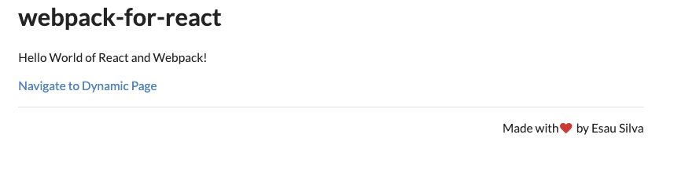
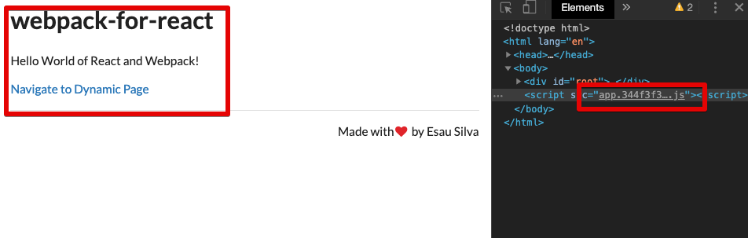
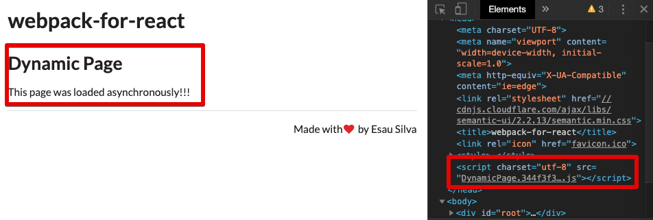

# React를 위한 Webpack - 03

> 해당 포스팅은 아래의 포스트를 번역 및 일부 설명을 추가하여 작성한 글입니다.
> [Learn Webpack for React - Esau Silva](https://esausilva.com/2018/01/13/learn-webpack-for-react/#comment-52112)

## Hot Module Replacement (HMR) 설정하기

이번에는 [React Hot Loader](https://github.com/gaearon/react-hot-loader)를 개발자 디펜던시에 추가 해보겠습니다. react-hot-loader는 코드가 변경 되었을 때 페이지를 새로고침 하지 않고 바뀐 부분만 변경해 주는 라이브러리 입니다.

```bash
yarn add react-hot-loader @hot-loader/react-dom -D
```

`.babelrc`를 열고 아래와 같이 코드를 수정합니다.

```javascript
{
  "presets": [
		// modules: false
    ["@babel/preset-env", { "modules": false }],
    "@babel/preset-react"
  ],
  "plugins": [
    "@babel/plugin-syntax-dynamic-import",
    "@babel/plugin-proposal-class-properties",
    "react-hot-loader/babel"
  ]
}
```

- `"modules": false` : ES6 모듈 문법을 다른 문법으로 변환하지 않고 그대로 사용하는 옵션입니다. Webpack의 [Tree Shaking](https://medium.com/naver-fe-platform/webpack%EC%97%90%EC%84%9C-tree-shaking-%EC%A0%81%EC%9A%A9%ED%95%98%EA%B8%B0-1748e0e0c365)이 ES6 모듈 방식인 import/export를 기반으로 하기 때문에 설정하는 옵션입니다.

`webpack.config.js`파일을 열어 아래와 같이 수정합니다. 

```javascript
...
module.exports = {
  output: {
    ...
    publicPath: '/'
  },
  resolve: {
    alias: {
      "react-dom": "@hot-loader/react-dom",
    },
  },
  ...
  plugins: [
    new webpack.HotModuleReplacementPlugin(),
    ...
  ],
  devServer: {
    ...
    hot: true
  }
};
```

- `publicPath: '/'` : 해당 설정이 없다면 중첩된 라우터에서 Hot reloading이 제대로 작동하지 않습니다.
- `webpack.HotModuleReplacementPlugin` : HMR로 업데이트 될 때 터미널에 읽기 좋은 모듈 이름을 출력합니다.
- `resolve: alias` : `react-dom`을 hot-loader의 사용자 정의 `react-dom`으로 대체합니다.
- `hot: true` : 서버에서 HMR을 가능하게 합니다.

`index.js`를 아래와 같이 변경하여 최종적으로 HMR을 적용합니다.

```javascript
import { hot } from "react-hot-loader/root";
import React from "react";
import ReactDOM from "react-dom";
import App from "./components/App";

// import "./index.css";

const render = (Component) =>
  ReactDOM.render(<Component />, document.getElementById("root"));

render(hot(App));
```

HMR 적용 테스트를 위해 아래와 같이 App.js를 수정하여 페이지를 로드합니다.

```javascript
import React from "react";
import { Switch, BrowserRouter as Router, Route } from "react-router-dom";

import Home from "./Home";
import DynamicPage from "./DynamicPage";
import NoMatch from "./NoMatch";

const App = () => {
  return (
    <Router>
      <div>
        <Switch>
          <Route exact path="/" component={Home} />
          <Route exact path="/dynamic" component={DynamicPage} />
          <Route component={NoMatch} />
        </Switch>
      </div>
    </Router>
  );
};

export default App;
```

서버를 실행하여 페이지를 확인해 봅시다.

```bash
yarn start
```



`Home.js`에 아래와 같이 수정하고 저장하면 별도의 새로고침 없이 글자가 바뀌는 것을 확인할 수 있습니다.

```javascript
import React from "react";
import { Link } from "react-router-dom";

import Layout from "./Layout";

const Home = () => {
  return (
    <Layout>
      <p>Hello World</p>
      <p>
        <Link to="/dynamic">Navigate to Dynamic Page</Link>
      </p>
    </Layout>
  );
};

export default Home;
```

만약 이 변화를 확인해 보고 싶으면 개발자 도구에서 더 많은 도구에서 Rendering → Paint flashing 체크 하고 저장하면 해당 `<p>`태그에 초록색으로 표시가 되는 것을 볼 수 있습니다.


## 코드 분할(Code Splitting)

코드 분할([Code Splitting](https://webpack.js.org/guides/code-splitting/))을 사용하면 애플리케이션을 하나의 큰 번들로 묶지 않고, 각각 비동기 또는 병렬로 여러 번들을 로드 할 수 있습니다. 또한, vendor 코드를 앱 코드와 분리하여 로딩 시간을 줄일 수 있습니다.

- 여기서 Vendor 코드는 react, react-dom과 같이 프로젝트에서 전역적으로 사용되는 라이브러리를 뜻합니다.

### Route 기준

경로를 기준으로 코드를 분할하는 방법은 여럿 있지만 포스팅에서는 [react-imported-component](There are several ways we can achieve code splitting by route, however in our case we will be using react-imported-component.)를 활용하려 합니다.

또한 유저가 다른 경로로 이동할 때, Loading spinner를 보여주려 합니다. 로드가 되었는지 아니면 로딩 중인지 알 수 없기 때문에 새 페이지가 로드되는 동안 사용자에게 빈 화면을 보여주는 것은 좋지 않습니다. `Loading` 컴포넌트의 경우 너무 짧은 시간 동안 깜빡하고 사라지지 않게 하기 위해 임의로 300 밀리 초 지연을 추가할 것입니다. 이를 위해 react-delay-render를 사용할 것입니다.

이제 필요한 라이브러리를 추가하고 시작합니다.

```bash
yarn add react-imported-component react-delay-render
```

`Loading` 컴포넌트를 생성합니다.

```bash
touch ./src/components/Loading.js
```

`Loading` 컴포넌트에 아래와 같이 코드를 작성합니다. `Loader`는 `semantic-ui-react`에서 불러와 추가합니다.

```javascript
import React from "react";
import { Loader } from "semantic-ui-react";
import ReactDelayRender from "react-delay-render";

const Loading = () => <Loader active size="massive" />;

export default ReactDelayRender({
  delay: 300,
})(Loading);
```

`App.js`를 열어 아래와 같이 비동기 처리를 합니다. 아래의 `/* webpackChunkName: - */`의 경우 Chunk 이름을 지정하기 위한 주석입니다. 아래에서 결과를 확인할 때 다시 설명하겠습니다.

```javascript
import React from "react";
import { Switch, BrowserRouter as Router, Route } from "react-router-dom";
import importedComponent from "react-imported-component";

import Home from "./Home";
import Loading from "./Loading";

const AsyncDynamicPAge = importedComponent(
  () => import(/* webpackChunkName:'DynamicPage' */ "./DynamicPage"),
  {
    LoadingComponent: Loading,
  }
);
const AsyncNoMatch = importedComponent(
  () => import(/* webpackChunkName:'NoMatch' */ "./NoMatch"),
  {
    LoadingComponent: Loading,
  }
);

const App = () => {
  return (
    <Router>
      <div>
        <Switch>
          <Route exact path="/" component={Home} />
          <Route exact path="/dynamic" component={AsyncDynamicPAge} />
          <Route component={AsyncNoMatch} />
        </Switch>
      </div>
    </Router>
  );
};

export default App;
```

여기서 해당 코드를 통해 세가지 번들 파일(혹은 Chunk라고 부르기도 함)이 만들어지게 됩니다. 

- 메인 App
- `DynamicPage` 컴포넌트
- `NoMatch` 컴포넌트

이제 번들의 파일 명을 바꿔 줍니다. `webpack.config.js`를 열어 아래와 같이 수정합니다.

```javascript
...
module.exports = {
  ...
  output: {
    filename: '[name].[hash].js',
    ...
  },
}
```

서버를 켜 한 번 확인 해봅시다.

```bash
yarn start
```

아래에서 볼 수 있듯이 번들 파일이 생성되었습니다.


개발자 도구로 보면 처음에 `app.[hash].js`파일이 먼저 로드 된 것을 확인할 수 있습니다.



그런 다음 링크를 통해 Dynamic Page로 이동하면 아래와 같이 `DynamicPage.[hash].js`가 추가되는 것을 확인할 수 있습니다. 이와 더불어 그 어떤 페이지에서도 `NoMatch` 컴포넌트가 로드되지 않습니다. 



추가로, 아까 앞에서 Chunk 이름과 관련된 주석은 Chunk 이름을 지정하기 위함입니다. 

```javascript
...
const AsyncDynamicPAge = importedComponent(
  () => import(/* webpackChunkName:'DynamicPage' */ "./DynamicPage"),
  {
    LoadingComponent: Loading,
  }
);
const AsyncNoMatch = importedComponent(
  () => import(/* webpackChunkName:'NoMatch' */ "./NoMatch"),
  {
    LoadingComponent: Loading,
  }
);
...
```


만약 아래와 같이 주석을 지우게 될 경우 Chunk 이름이 사라진 것을 볼 수 있습니다.

```javascript
...
const AsyncDynamicPAge = importedComponent( () => import("./DynamicPage"),
  {
    LoadingComponent: Loading,
  }
);
const AsyncNoMatch = importedComponent( () => import("./NoMatch"),
  {
    LoadingComponent: Loading,
  }
);
...
```


### Vendor 기준

이번에는 vendor를 기준으로 앱을 나눠보도록 하겠습니다 `webpack.config.js`에 아래와 같이 설정을 바꿔 봅시다.

```javascript
...
module.exports = {
...
  entry: {
    vendor: ['semantic-ui-react'],
    app: './src/index.js'
  },
  ...
  optimization: {
    splitChunks: {
      cacheGroups: {
        styles: {
          name: 'styles',
          test: /\.css$/,
          chunks: 'all',
          enforce: true
        },        
        vendor: {
          chunks: 'initial',
          test: 'vendor',
          name: 'vendor',
          enforce: true
        }
      }
    }
  },
  ...
};
```

- `entry.vendor: ['semantic-ui-react']` : 메인 앱에서 분리하여 Vendor Chunk로 만들 라이브러리를 명시합니다.
- `optimization` : 이 항목을 생략해도 Webpack은 Vendor에 따라 앱을 분할합니다. 해당 항목을 추가하지 않으면 보통 번들 크기가 큽니다.

실행하면 아래와 같이 `styles`와 `vendor` Chunk가 추가되어 있는 것을 확인할 수 있습니다.


아래는 `webpack.config.js`의 전체 코드입니다.

```javascript
const webpack = require("webpack");
const HtmlWebpackPlugin = require("html-webpack-plugin");
const port = process.env.PORT || 3000;
module.exports = {
  mode: "development",
  entry: {
    vendor: ["semantic-ui-react"],
    app: "./src/index.js",
  },
  output: {
    filename: "[name].[hash].js",
  },
  resolve: {
    alias: {
      "react-dom": "@hot-loader/react-dom",
    },
  },
  devtool: "inline-source-map",
  module: {
    rules: [
      {
        test: /\.(js)$/,
        exclude: /node_modules/,
        use: ["babel-loader"],
      },
      {
        test: /\.css$/,
        use: [
          {
            loader: "style-loader",
          },
          {
            loader: "css-loader",
            options: {
              modules: true,
              localsConvention: "camelCase",
              sourceMap: true,
            },
          },
        ],
      },
    ],
  },
  optimization: {
    splitChunks: {
      cacheGroups: {
        styles: {
          name: "styles",
          test: /\.css$/,
          chunks: "all",
          enforce: true,
        },
        vendor: {
          chunks: "initial",
          test: "vendor",
          name: "vendor",
          enforce: true,
        },
      },
    },
  },
  plugins: [
    new webpack.HotModuleReplacementPlugin(),
    new HtmlWebpackPlugin({
      template: "public/index.html",
      favicon: "public/favicon.ico",
    }),
  ],
  devServer: {
    host: "localhost",
    port: port,
    historyApiFallback: true,
    open: true,
    hot: true,
  },
};
```